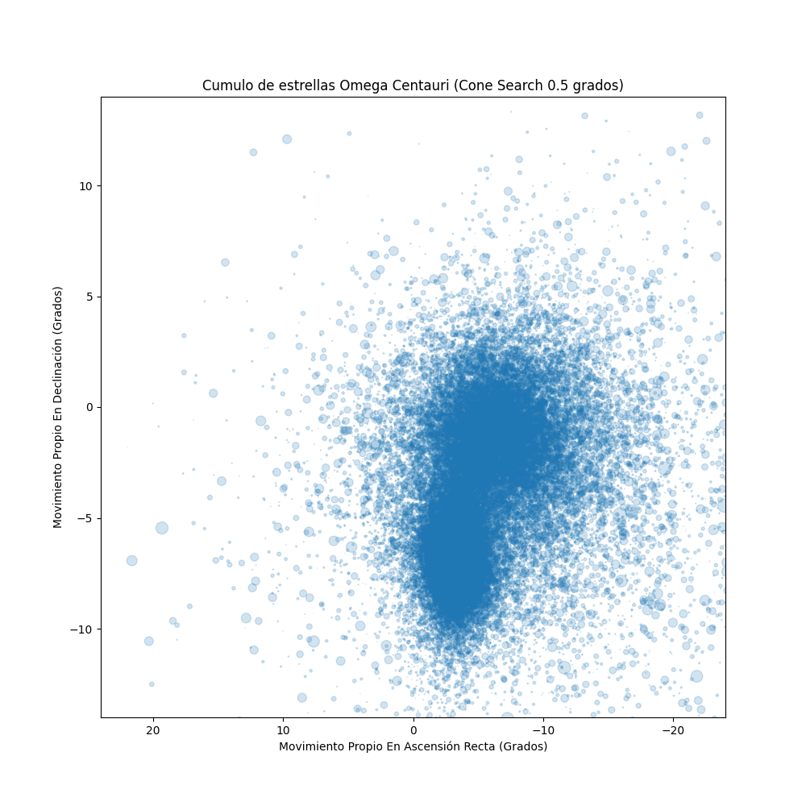
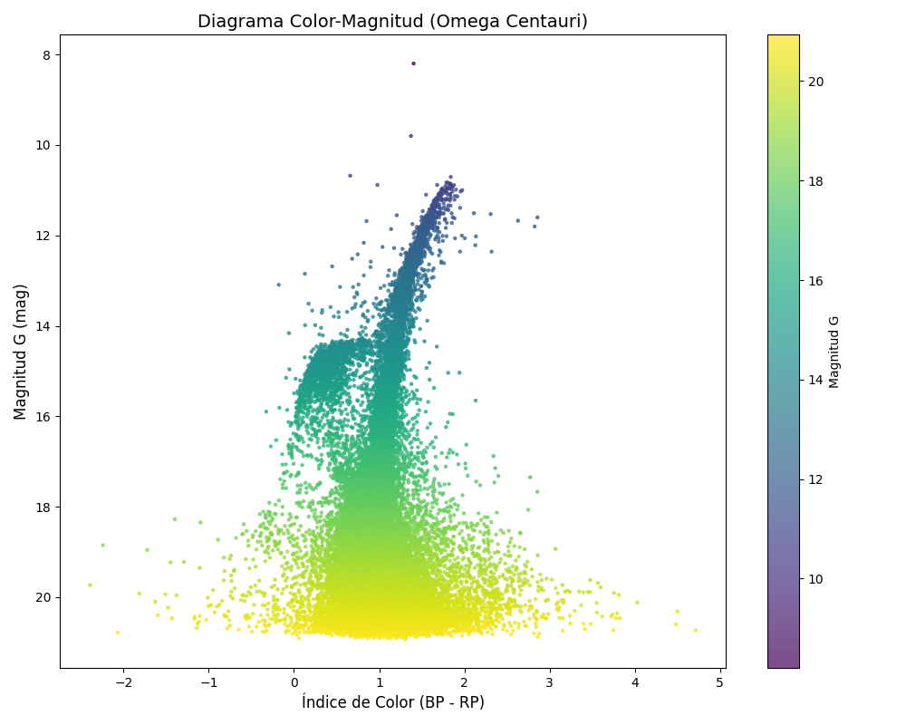

# NGC 5139 – Cúmulo Globular Omega Centauri

## Coordenadas en grados decimales

| Coordenada | Valor (grados decimales) |
|------------|--------------------------|
| **Ascensión Recta (RA)** | 201.6970° |
| **Declinación (Dec)** | -47.4795° |

## Gráficas de Análisis

### Gráfica 1


### Gráfica 2


## Limpieza del diagrama HR con SQL

Para construir un diagrama HR más claro, primero se filtraron las estrellas "intrusas" con una consulta SQL sobre el movimiento propio:

```sql
SELECT *
FROM estrellas
WHERE pmDE BETWEEN -11 AND -4
	AND pmRA BETWEEN -9 AND 1;
```

Este recorte en el espacio de movimiento propio elimina gran parte de estrellas de campo que no pertenecen al cúmulo y deja una muestra más coherente de Omega Centauri. Como resultado, en la Gráfica 2 (diagrama Color-Magnitud) se distinguen mejor las secuencias estelares principales y disminuye el ruido visual, por lo que la interpretación astrofísica del cúmulo es más confiable.