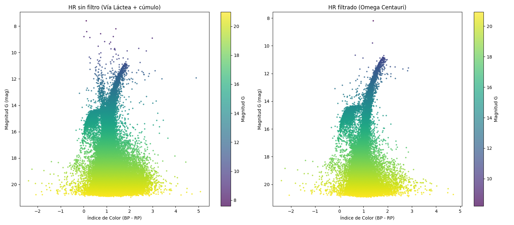

# 🌌 NGC 5139 – Cúmulo Globular Omega Centauri

## 📍 Coordenadas en grados decimales

| Coordenada | Valor (grados decimales) |
|------------|--------------------------|
| **Ascensión Recta (RA)** | 201.6970° |
| **Declinación (Dec)** | -47.4795° |

Estas coordenadas corresponden al centro del cúmulo globular Omega Centauri, uno de los sistemas estelares más masivos y complejos de la Vía Láctea.

---

## 📊 Gráficas de Análisis

### 🔹 Gráfica 1: Movimiento propio (pmRA vs pmDE)


Esta gráfica muestra la distribución del movimiento propio de las estrellas en la región observada.

### Interpretación física:

Se distinguen claramente dos poblaciones:

- **Nube dispersa centrada cerca de (0,0):**  
  Corresponde a estrellas de campo de la Vía Láctea. Estas estrellas no están gravitacionalmente ligadas entre sí y presentan movimientos propios variados debido a sus diferentes posiciones y velocidades en la galaxia.

- **Racimo compacto desplazado:**  
  Corresponde a las estrellas del cúmulo Omega Centauri. Estas estrellas comparten un movimiento común, lo que indica que están gravitacionalmente ligadas y se mueven como un sistema coherente alrededor de la galaxia.

👉 Este resultado demuestra que es posible identificar miembros de un cúmulo estelar utilizando únicamente información cinemática.

---

## 🧠 Filtro cinemático con SQL

Para aislar las estrellas pertenecientes al cúmulo, se aplicó el siguiente filtro en el espacio de movimiento propio:

```sql
SELECT *
FROM estrellas
WHERE pmDE BETWEEN -11 AND -4
  AND pmRA BETWEEN -9 AND 1;
```

Este recorte selecciona la región donde se concentra el cúmulo en la gráfica de movimiento propio.

### Interpretación:

- Se eliminan estrellas de fondo (contaminación de la Vía Láctea)
- Se conserva una población estelar físicamente coherente
- Se mejora significativamente la calidad del análisis astrofísico

---

## 🌈 Gráfica 2: Diagrama Color–Magnitud (HR)


Se construyó el diagrama usando:

- Eje X: índice de color (BP - RP)
- Eje Y: magnitud G (invertida)

### Interpretación física:

Después del filtrado, el diagrama revela claramente:

- **Secuencia principal:**  
  Estrellas en fase de fusión de hidrógeno.

- **Punto de turn-off:**  
  Indica la edad del cúmulo (las estrellas más masivas ya han evolucionado).

- **Rama gigante roja:**  
  Estrellas evolucionadas, más frías pero más luminosas.

---

## ⚖️ Comparación: antes vs después del filtrado





| Sin filtro | Con filtro |
|-----------|-----------|
| Diagrama disperso | Secuencia definida |
| Mezcla de poblaciones | Población coherente |
| Difícil interpretación | Interpretación clara |

👉 El filtrado cinemático permite estudiar la evolución estelar real del cúmulo sin contaminación.

---

## Conclusión 

El análisis demuestra que:

- Omega Centauri es un sistema gravitacionalmente ligado con movimiento coherente.
- La selección por movimiento propio permite aislar sus estrellas de las de la Vía Láctea.
- El diagrama HR resultante muestra una población estelar bien definida y coevolucionada.

Además, la complejidad de su población estelar respalda la hipótesis de que Omega Centauri podría ser el núcleo remanente de una galaxia enana que fue absorbida por la Vía Láctea hace miles de millones de años.